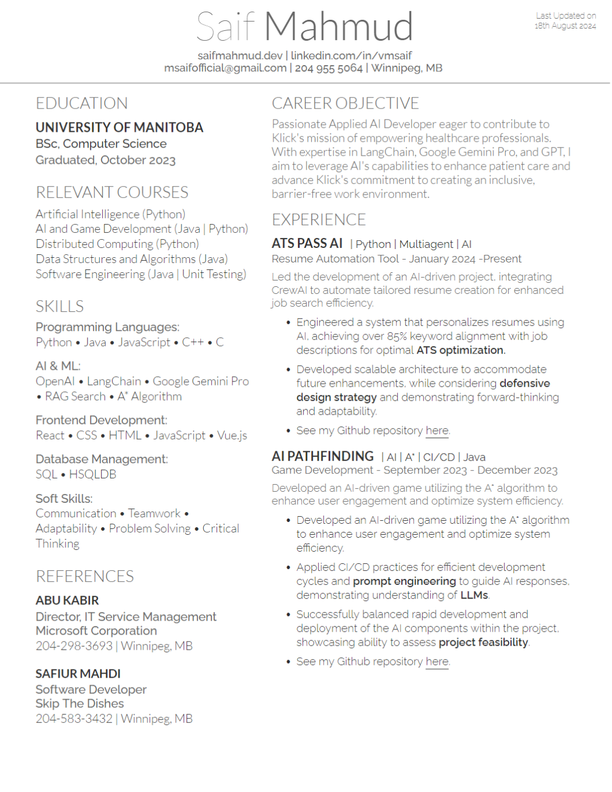

# ATS Pass AI

[](https://hits.sh/github.com/vmsaif/ats-pass-ai/)

## Project Description

The idea is to craft one unique resume for one job application. With this approach, every resume is designed anew, ensuring it's **highly** tailored to the specific job description and optimized to pass the Applicant Tracking System (ATS). 

### What is an Applicant Tracking System (ATS)?
An Applicant Tracking System (ATS) is a software application that assists employers in managing the recruitment process. It is used to collect, sort, scan, and rank job applications. ATSs are employed by companies of all sizes to organize and search for job applicants based on the job description. This tool is the reason why many resumes are rejected before they even reach a human recruiter. It works by scanning resumes for keywords and phrases that match the job description. If a resume doesn't have enough keywords, it's automatically rejected. Even though an applicant may be well-qualified for the role, minor differences in terminology can lead to a resume being overlooked by the ATS. 

For instance,

- A job description requires "customer relationship management," but the resume mentions "client engagement expertise."
- The job listing asks for "proficient in Microsoft Excel," while the resume states "experienced in spreadsheet software."
- The employer seeks "strategic planning" capabilities, and the applicant describes their experience with "long-term business planning."

In these cases, the resume will score poorly in the ATS, even though the applicant possesses the necessary skills and experience. This discrepancy highlights the critical need for precise language alignment between the job description and the resume. Thus, each resume must be touched up to match the job description's keywords and phrases and increase the chances of passing through the ATS.

## We can use ChatGPT to generate/tailor a resume for a job description. How is this different?

### Problem With ChatGPT and Similar Chatbots: 
The chatGPT model is a powerful tool for generating text based on a prompt. ChatGPT does somewhat well in generating resumes per the provided job description. However, to highly tailor a resume to a job description, is a multi-step process. Thus, a user needs to chat back and forth with the model to tailor the resume appropriately. This process is time-consuming and inefficient.

There are so many things that need to be considered to achieve a high match rate with the job description. There comes the need for this project.

Here’s how to include examples without JSON syntax, making it more natural and engaging:

### Solution:

This program is your ultimate tool for creating highly personalized resumes efficiently, saving you time and increasing your chances of catching an employer's eye.

ATS Pass AI is an innovative tool designed to automate the creation of personalized resumes. It utilizes several AI agents, each specializing in different aspects of the resume creation process. They collaborate to make the best possible resume for the user. The system is designed to help job seekers create resumes that are highly tailored to specific job descriptions, increasing their chances of passing through Applicant Tracking Systems (ATS) and landing interviews.

The system aims to achieve at least an 85% keyword match with job descriptions, ensuring that the resumes are tailored and ATS-friendly. Here are some practical examples of how this AI system can help you tailor a resume that stands out:

```plaintext
**Example 1:**
- **Original Sentence:** "Applied expertise in Generative AI and RAG Search, showcasing a strong understanding of core concepts sought after for this role."
- **Revised Sentence:** "Applied expertise in **Generative AI** and RAG Search, showcasing a strong understanding of **LLMs**."
- **Keywords Added:** "LLMs"
- **Rationale:** Replacing "core concepts" with the specific term "LLMs" (Large Language Models) creates a stronger connection to the job description's focus on this technology.

**Example 2:**
- **Original Sentence:** "Led multiple high-performing software development projects, focusing on operational efficiency and team collaboration."
- **Revised Sentence:** "Led multiple software development projects, focusing on **operational efficiency** and team collaboration."
- **Keywords Added:** "operational efficiency"
- **Rationale:** Highlighting "operational efficiency" as it is mentioned in the job description, emphasizing the applicant's alignment with the role's requirements. It also removes the redundant term "high-performing."
```

### Example: Experience Selection Rationale:

```plaintext
**Selected for the Resume:**
- **ATS Pass AI:** Directly matches job requirements including Generative AI, Python, and SQL, as evidenced by its utilization in developing an AI-driven system. The project highlights the applicant's understanding of AI principles and their application in a practical context.
- **AI Pathfinding:** Demonstrates relevant AI development experience, including the use of CI/CD practices and prompt engineering, directly aligning with the required skills for the Applied AI Developer role.

**Not Prioritized:**
- **Programming Mentor:** While showcasing mentorship skills, it lacks direct relevance to AI development or the technologies specified in the job description.
- **Blockchain Car Mileage Tracker:** Focuses on Blockchain Development, which is not a primary requirement for the Applied AI Developer role.
- **Recursive Ray Tracing:** Primarily involves graphics programming, which is not a core requirement for the AI-focused position.
```

Similarly, the system can identify and add relevant keywords, rephrase sentences, prioritize key skills, and optimize the resume's content to align with the job description. This level of customization ensures that the resume is not only ATS-friendly but also tailored to the specific requirements of the job.

## Stages of Generating the Resume 🚀

The project is currently in the **active development stage**. The following features have been implemented:

1. **User Information Collection** 📋
   - The system can extract and organize user data provided by the user in an unorganized way. 

2. **Job Description Analysis** 🤝
   - The system can analyze job descriptions to identify key keywords and requirements.

3. **Resume Creation** 🧑‍💼
   - The system can integrate user information with job description analysis to draft resumes.

4. **LaTeX Resume Generation** 🛠️
   - The system can convert finalized resumes into professionally formatted LaTeX documents.

## An Overview of the System
The user begins by providing their information however they see fit, also can upload their resume. Then the system will extract and organize the user data and understand the user's skills and experiences. The user can then upload job descriptions which will be analyzed to identify key phases, keywords and requirements. 

The system will then compare the user data with the job description to generate a resume that is tailored to the job. The user can then download the resume in LaTeX format or plain text format. More features will be added in the future to make the system more user-friendly and efficient.

### Key Features
- **User Information Collection**: Extracts and organizes user data from provided text files.
- **Job Description Analysis**: Analyzes job descriptions to identify key keywords and requirements.
- **Resume Creation**: Integrates user information with job description analysis to draft resumes.
- **LaTeX Resume Generation**: Converts finalized resumes into professionally formatted LaTeX documents.

## Installation and Usage

### Prerequisites
- Ensure Python 3.8 or higher is installed on your machine. [Download Python](https://www.python.org/downloads/) and include it in your system's PATH during installation.


### 1: Clone the repository and install the required Python libraries:
```bash
git clone https://github.com/vmsaif/ats-pass-ai
```

### 2: Install poetry

```bash
pip install poetry
```

### 3: Install the Required Libraries

```bash
python poetry_command.py lock

```
   
```bash
python poetry_command.py install
```

### 4: Configure API Key
- Obtain a GOOGLE_API_KEY by following the instructions at [Google Cloud Console](https://console.cloud.google.com/apis/credentials). Ensure the API key has appropriate permissions enabled.

- `Create` a .env file in the root directory and add:

```plaintext
GOOGLE_API_KEY=YOUR_GOOGLE_API_KEY_HERE
```

Note: Replace `YOUR_GOOGLE_API_KEY_HERE` with your actual API keys. No need to include quotes.

### 5: Prepare Your Data

- Add your information or resume to `shared/info_files/applicant_info.txt`.
- Place the job description link in `info_collection/src/info_collection/main.py` in the job_description_link variable. (easier way to do this will be added soon)

### 6: Run the Application
From the root directory, run the following command:

```bash
python main.py new

```

from the next runs, you can run the following command as the user information will be saved.

```bash
python main.py
```

Wait for the program to finish processing. The approximate time is 7 minutes.

### 7. Retrieve Your Resumes
- Find the generated resumes in the output/ directory.

## Sample Output

<!-- assets\images\Resume_Example.png -->


